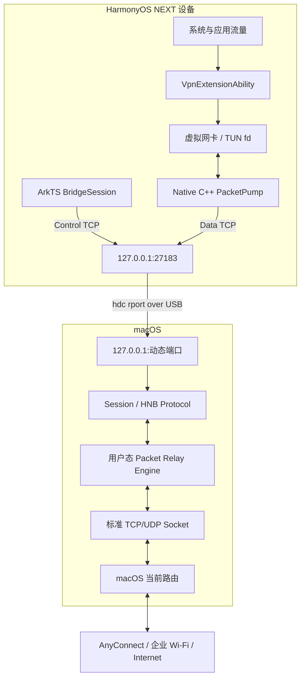
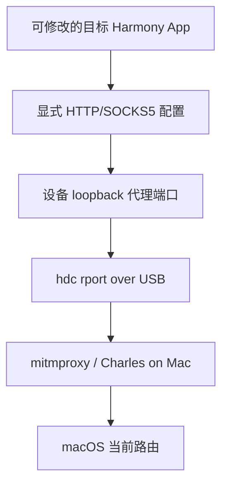

# HarmonyNetBridge 技术方案设计文档

> 状态：已批准的系统设计，尚未进入编码
>
> 日期：2026-08-06
>
> 适用范围：HarmonyOS NEXT 开发设备、macOS Apple Silicon、DevEco Studio / hdc 调试环境

## 1. 文档目标

HarmonyNetBridge 是一个开源开发者工具，目标是在不依赖 Android API、无需 root、无需修改 macOS 系统网络接口的前提下，让 HarmonyOS NEXT 手机通过 USB 和 hdc 复用 Mac 的网络连接。

主要场景：

- Mac 已连接 Cisco AnyConnect、企业 Wi-Fi 或其他公司网络，手机无法直接加入该网络。
- HarmonyOS NEXT App 需要在真机上访问企业内网接口。
- 开发者需要通过 mitmproxy 或 Charles 调试目标 App 的 HTTP/HTTPS 请求。
- DevEco Studio 真机开发需要稳定、可诊断的 USB 网络通道。

本设计是一份分阶段的总体架构文档，不是一份覆盖所有阶段的一次性实现计划。后续必须按 Phase 1、Gate V、Lite、Phase 2、Phase 3、Phase 4 分别制定和执行实现计划，不能把 Lite 的成功视为完整 VPN 目标已经完成。

### 1.1 已批准范围

- Mac 端采用 Go 实现 CLI 和后台服务，支持 Apple Silicon。
- HarmonyOS 端采用 ArkTS、Stage 模型和公开的 `VpnExtensionAbility`。
- Phase 2 的高频 TUN 与数据 socket I/O 下沉到 Native C++。
- USB 通信采用 hdc `rport` 和两端 loopback TCP。
- Phase 1 只实现项目底座、`start/status/stop` 和 `hello/world`。
- Phase 2 前必须完成最小 VPN 真机能力探针 Gate V。
- HarmonyNetBridge Lite 作为提前可用的显式 HTTP/SOCKS 代理桥，但不替代全局 VPN。

### 1.2 非目标

- 不依赖 Android `VpnService`、adb 或其他 Android API。
- 不实现内核驱动、USB 自定义协议、macOS utun 注入、Packet Filter 或 root 权限方案。
- 不承诺绕过企业安全策略、设备管理策略、证书策略或应用市场审核。
- 不静默安装系统级受信任 CA。
- Phase 1 不实现 IP packet Relay、自动重连、多设备并发或抓包自动化。
- 不从零实现 TCP/IP 状态机。

## 2. 结论摘要

项目在 API 层面具备可行性，但完整 VPN 的最终可行性仍然是“有条件成立”：

1. HarmonyOS NEXT 的公开 `@ohos.net.vpnExtension` API 可以创建第三方用户态 VPN、返回虚拟网卡 fd、配置地址/路由/DNS，并保护隧道 socket 免受 VPN 递归捕获。
2. hdc 提供与 adb forward/reverse 对应的 `fport` 和 `rport`。HarmonyNetBridge 应使用设备到 Mac 方向的 `rport`。
3. VPN 可以持续运行，但并非不受系统生命周期约束的永久守护进程。首次启用需要用户信任，同时只能存在一个活动 VPN；调用进程或 VPN 服务进程退出时连接会停止。
4. hdc `rport` + loopback TCP 是当前开发者场景下最合适的 USB 通信方案。它不需要自行实现 USB 协议，但其长期传输稳定性必须真机验证。
5. Lite 显式代理可先产生开发价值，但只能覆盖主动配置代理的目标 App，不能代表系统全局流量已经接通。

推荐路线：

```text
Phase 1：CLI + App + hdc + hello/world
                    ↓
Gate V：最小 VPN/TUN 真机能力探针
                    ↓
HarmonyNetBridge Lite：显式 HTTP/SOCKS 代理桥
                    ↓
Phase 2：完整 IPv4 TCP/UDP/DNS VPN Relay
                    ↓
Phase 3：稳定性、配置化、重连、多设备和 IPv6
                    ↓
Phase 4：mitmproxy/Charles 开发体验自动化
```

## 3. 证据基线

### 3.1 当前本机环境快照

设计确认时实际核对的环境：

| 项目 | 当前值 |
|---|---|
| DevEco Studio | 26.0.0，build `DS-243.24978.46.36.2600461` |
| HarmonyOS SDK | API 26，26.0.0.23 Beta1 |
| hdc | 3.2.0e，macOS arm64 可执行文件 |
| 当前 USB 目标 | 1 个，状态为 `Offline` |
| 工作区 | 空目录，确认方案前未初始化 Git |

该快照只能证明本机工具和声明文件存在，不能证明目标商业手机上的运行行为。设备当前不在线，因此本设计明确区分静态/源码证据与真机证据。

### 3.2 已核对的 API 与源码事实

- `TCPSocket.getSocketFd()` 自 API 10 提供，可取得 ArkTS TCP socket 的 fd。
- `VpnConnection.protect(socketFd)` 自 API 11 提供，用于让隧道 socket 走底层网络而不进入 VPN。
- `VpnConnection.create(config)` 返回 VPN 虚拟网卡 fd。
- 当前官方 `VPNControl_Case` 示例由 Native C++ 创建 POSIX UDP socket，把 fd 交给 ArkTS 调用 `protect()`，随后创建 VPN，并在 Native 线程中直接 `read(tunFd)` / `write(tunFd)`。
- hdc 转发源码使用 `uv_listen()`，每次连接回调创建独立 context 并执行 `uv_accept()`，因此一个端口映射可以承载多条 TCP 连接。

## 4. HarmonyOS NEXT 能力可行性分析

### 4.1 `VpnExtensionAbility` 是否满足用户态 VPN

结论：API 模型满足。

使用公开的 `@ohos.net.vpnExtension`，而不是需要系统权限的 `@ohos.net.vpn`。所需能力包括：

- 通过 `startVpnExtensionAbility()` 启动 VPN Extension。
- 通过 `createVpnConnection(context)` 创建 VPN 控制对象。
- 通过 `create(config)` 配置虚拟地址、路由、DNS、MTU 和应用范围，并取得 TUN fd。
- 通过 `protect(fd)` 保护桥接 socket。
- 通过 `destroy()` 销毁 VPN。
- 在 Native C++ 中读取和写回原始 IP packet。

公开第三方 VPN 路径只需要普通的 `ohos.permission.INTERNET`。系统级 VPN 管理接口及 `ohos.permission.MANAGE_VPN` 不属于本项目实现路径。

仍需真机确认的条件：

- `create()` 可能返回 `2203001`，表示当前用户类型拒绝创建 VPN。
- 企业设备管理可能禁止第三方 VPN。
- 公开 API 可调用不等同于一定满足应用市场发布政策。

### 4.2 hdc 是否提供 adb forward/reverse 类能力

结论：支持。

- `fport localnode remotenode`：Mac 发起连接，转发到设备。
- `rport remotenode localnode`：设备发起连接，转发到 Mac。

HarmonyNetBridge 的 App 主动连接 Mac，因此使用：

```text
hdc -t <selected-target> rport tcp:<device-port> tcp:<mac-port>
```

设备侧监听入口只暴露在 `127.0.0.1`，Mac listener 也只绑定 `127.0.0.1`。不在 LAN 上公开桥接端口。

hdc 源码能够支持同一映射中的多连接，但目前没有官方长期 VPN 负载稳定性保证。双连接、持续时长、锁屏和拔线行为必须作为真机验收项目。

### 4.3 第三方 App 是否能长期运行 VPN

结论：可以持续运行，但有明确生命周期边界。

- 首次创建第三方 VPN 时系统要求用户信任。
- 同一时间只能有一个活动 VPN。
- VPN 状态应在应用 UI 和系统通知中清晰显示。
- 调用进程退出或 VPN 服务进程死亡时，VPN 会停止。
- 系统资源管理、企业策略、用户主动终止均可能结束连接。

所以 HarmonyNetBridge 必须把“长时间运行”定义为可观测、可恢复、断开时安全失败的开发会话，而不是不可终止的后台 daemon。

### 4.4 USB 通信最佳方案

结论：hdc `rport` + TCP loopback。

理由：

- 与 DevEco Studio 开发者工作流一致。
- 不需要新的系统权限、内核驱动或自定义 USB accessory 协议。
- Go、ArkTS 和 Native C++ 都能使用普通 TCP。
- hdc 处理 USB 发现、复用和数据搬运。
- Mac 出站继续使用标准 socket，从而自然遵循 macOS 当前路由和 Cisco AnyConnect 路由策略。

限制：

- 依赖设备开启调试并被 hdc 识别。
- 仅定位为开发者工具，不是普通消费者的 USB 网络共享产品。
- hdc 的生命周期、吞吐和断连行为需要应用层状态机补足。

## 5. 路线选择

| 路线 | 优点 | 缺点 | 结论 |
|---|---|---|---|
| 完整 VPN 优先 | 直接接近最终目标 | 在权限、TUN 和 hdc 尚未真机验证时投入最高 | 不采用 |
| 只做 Lite | 快速、简单、抓包价值明确 | 不能覆盖系统和任意 App 流量 | 不能作为最终目标 |
| 公共底座 + Gate V + Lite + 完整 VPN | 先消除最大风险，同时保留最终方向 | 里程碑更多，需要清晰标注能力边界 | 采用 |

Lite 是提前交付的里程碑。完整项目只有在 Phase 2、Phase 3 和 Phase 4 的明确验收项都满足后，才可以宣称实现了类似 gnirehtet 的能力。

## 6. 系统架构

### 6.1 完整 VPN 架构



Mac Relay 不向物理网卡、utun 或 pf 注入原始 IP packet。它把设备侧 TCP/UDP 流转换成 Mac 上的标准 socket，再由用户态网络栈生成返回 IP packet。这是 gnirehtet 类方案的关键模型。

### 6.2 Lite 架构



Lite 的 HTTP/SOCKS 流量保持原生协议，不套 HNB 帧。它使用独立、由本工具精确管理的 hdc 映射。

## 7. 技术选型

| 层 | 选型 | 原因 |
|---|---|---|
| Mac CLI / daemon | Go | 单二进制、Apple Silicon 友好、并发网络与测试成本低 |
| CLI 基础 | Go 标准库优先 | Phase 1 不引入不必要的 CLI 框架 |
| 日志 | `log/slog` + 大小轮转 | 结构化、可脱敏、方便诊断 |
| Harmony UI / 生命周期 | ArkTS + Stage 模型 | 官方应用与 Extension 模型 |
| VPN | `@ohos.net.vpnExtension` | 面向第三方应用的公开 API |
| 数据泵 | Native C++ / Node-API | 直接操作 TUN fd 与数据 socket，减少逐包跨层复制 |
| USB 通道 | hdc `rport` | 官方开发连接工具，避免自定义 USB 协议 |
| Phase 2 用户态栈 | 固定版本的 gVisor Netstack，封装在 `relay.Engine` 后 | 优先保持单个 Go 二进制，避免自写 TCP 栈 |
| Relay 备选 | 独立 Rust Relay | 仅当明确的 Netstack 验收门槛失败时采用 |

Rust 不优于 Go 完成 Phase 1，因此 Mac CLI 不改用 Rust。Phase 2 先做受控的 gVisor Netstack 验证；如果 TCP、UDP、DNS、资源占用或可维护性门槛失败，再以独立进程方式引入 Rust Relay，不能让两种实现同时渗透其他模块。

## 8. 组件边界与目标目录

```text
HarmonyNetBridge/
├── cmd/
│   └── harmony-netbridge/       CLI 入口
├── internal/
│   ├── cli/                     命令解析和用户输出
│   ├── daemon/                  后台进程与本地控制 socket
│   ├── hdc/                     hdc 发现、设备解析和映射生命周期
│   ├── session/                 Control/Data 连接关联
│   ├── protocol/                HNB/1 编解码和状态机
│   ├── state/                   status 快照
│   ├── logging/                 日志、轮转、脱敏
│   ├── relay/                   Phase 2 relay.Engine 边界
│   └── proxy/                   Lite / Phase 4 代理模式
├── protocol/
│   ├── PROTOCOL.md              线协议规范
│   └── testdata/                Go/ArkTS/C++ 共用 golden frames
├── harmony/
│   └── HarmonyNetBridge/        Stage 模型应用
├── docs/
│   └── spark/                   已批准设计文档
└── README.md
```

职责规则：

- `internal/hdc` 不理解 HNB 帧，只管理工具和映射。
- `internal/protocol` 是纯编解码与协议状态机，不执行进程或网络操作。
- `internal/session` 不实现 TCP/IP Relay，只管理连接身份和会话生命周期。
- `internal/relay` 通过稳定接口隐藏 gVisor 或 Rust 实现。
- Harmony 端 ArkTS 不与 Native 同时读取同一个 fd。
- Phase 1 可以创建 `relay.Engine` 边界，但不得填充虚假的数据转发实现。

## 9. Mac CLI 与生命周期

### 9.1 命令范围

Phase 1：

```text
harmony-netbridge start
harmony-netbridge status
harmony-netbridge stop
```

允许提供全局 `--hdc <path>` 和 `--device <target>` 参数，但不提前实现 Phase 3 的 `devices` 子命令。

### 9.2 hdc 查找顺序

1. 显式 `--hdc`。
2. `HARMONY_NETBRIDGE_HDC` 环境变量。
3. `PATH` 中的 `hdc`。
4. DevEco Studio 默认 SDK 路径。

找到后必须运行版本检查。找不到或不可执行时返回 `HDC_NOT_FOUND`，错误消息同时给出已检查的位置和修复提示。

### 9.3 设备选择

- 只把 `Online` 目标视为可用。
- 0 个在线目标：返回 `NO_DEVICE` 或 `DEVICE_OFFLINE`。
- 1 个在线目标：自动选择。
- 多个在线目标：要求显式 `--device`。
- 绝不静默操作所有设备。
- 日志和默认状态输出不显示完整目标唯一标识。

### 9.4 `start`

1. 获取单实例锁。
2. 启动本用户后台 supervisor；不安装 LaunchAgent。
3. Mac 先绑定 `127.0.0.1:0`，由系统分配空闲端口。
4. 创建 `device 127.0.0.1:27183 -> Mac 127.0.0.1:<动态端口>` 的精确 `rport` 映射。
5. 记录目标、映射元组、进程和启动时间。
6. 等待 HarmonyNetBridge App 连接；Phase 1 允许开发者手动打开 App。
7. App 启动后自动连接并完成 `hello/world`。

`start` 在 listener 和 hdc 映射就绪后即成功返回，并明确显示 `WaitingForApp` 或 `Connected`。它不把“后台进程已启动”误报为“App 已连接”。

### 9.5 `status`

`status` 必须连接本地 Unix 控制 socket 获取实时状态。只检查 PID 文件不能作为服务健康证据。

默认输出包括：

```text
Daemon:     RUNNING
Device:     Harmony device (redacted)
Transport:  CONTROL_CONNECTED
VPN:        STOPPED
Message:    Phase 1 handshake completed
```

### 9.6 `stop`

1. 向 App 发送 `STOP_REQUEST`。
2. 有 VPN 时先停止 PacketPump，再销毁 VPN。
3. 关闭数据和控制连接。
4. 删除本次实例记录的精确 hdc 映射。
5. 关闭 listener、控制 socket 和 supervisor。
6. 清除本次实例状态。

所有步骤必须幂等。工具不能删除无法证明属于自己的 hdc 映射。

### 9.7 运行状态与日志

- Unix 控制 socket 和瞬时状态放在当前用户缓存目录下的 `HarmonyNetBridge/runtime`。
- 日志放在 `~/Library/Logs/HarmonyNetBridge/`。
- 日志采用结构化字段，支持控制台可读输出和大小轮转。
- 不记录 packet payload、证书私钥、完整 session token、完整设备唯一标识或代理凭据。

## 10. HarmonyOS 应用结构

```text
EntryAbility / ArkUI
├── 连接、VPN 和错误状态
├── 启动/停止入口
└── Gate V 开发者探针入口

BridgeSession（可复用 ArkTS 组件）
├── Phase 1 由 EntryAbility 实例化
├── Phase 2 由 VpnExtensionAbility 实例化
├── HNB/1 控制帧
└── controlSocket.getSocketFd()

VpnExtensionAbility（Phase 2 资源所有者）
├── BridgeSession / Control TCP
├── VpnController
└── PacketPump 生命周期

VpnController（ArkTS，归 VpnExtensionAbility 所有）
├── VpnExtensionAbility 生命周期
├── protect(controlFd/dataFd)
├── create(config)
└── destroy()

PacketPump（Native C++，Phase 2，归 VpnExtensionAbility 所有）
├── 创建并持有 Data TCP socket
├── 独占 TUN fd
├── TUN -> IP_PACKET
└── IP_PACKET -> TUN
```

`module.json5` 注册类型为 `vpn` 的 Extension Ability，并申请 `ohos.permission.INTERNET`。不申请 `MANAGE_VPN`。

Phase 1 的 `BridgeSession` 只用于证明 App、hdc 和 Mac 的控制通信。进入 Phase 2 后，旧的 Phase 1 会话先关闭，再由 `VpnExtensionAbility` 创建新的 Control/Data 会话；不能把 `EntryAbility` 持有的 live socket 跨 Ability 生命周期共享给 VPN。EntryAbility 只是 UI 和启停控制面，不拥有活动 VPN 的 tunnel fd 或 socket。

## 11. Control/Data 双连接设计

同一 hdc 映射承载两条独立 TCP 连接：

| 通道 | 引入阶段 | 所有者 | 内容 |
|---|---|---|---|
| Control | Phase 1 | EntryAbility 内的 ArkTS `BridgeSession` | hello/world、状态、错误、停止命令 |
| Control | Phase 2 | VpnExtensionAbility 内的 ArkTS `BridgeSession` | VPN 会话握手、状态、错误、停止命令 |
| Data | Phase 2 | VpnExtensionAbility 所有的 Native C++ `PacketPump` | 原始 IP packet |

拆分原因：

- ArkTS 和 Native 不争用同一 socket fd。
- 大量 IP 数据不会阻塞停止与错误控制帧。
- Native 可以在 TUN 与 socket 之间直接搬运数据。
- Phase 1 不需要提前实现 Native 数据路径。

### 11.1 VPN 创建前的强制顺序

```text
VpnExtensionAbility 建立 ArkTS Control TCP
        ↓
controlSocket.getSocketFd()
        ↓
Native 建立 Data TCP 并返回 dataSocketFd
        ↓
protect(controlSocketFd)
        ↓
protect(dataSocketFd)
        ↓
两项均成功
        ↓
VpnConnection.create(config)
        ↓
把 tunFd 交给 Native PacketPump
```

任一 `protect()` 失败时不得创建 VPN。VPN 活动期间任一传输连接断开时，先销毁 VPN，再重建连接、重新保护并重新创建 VPN，避免递归和系统流量黑洞。

## 12. HNB/1 协议

### 12.1 固定头部

所有整数使用网络字节序。固定头部为 16 字节：

| 偏移 | 长度 | 字段 |
|---:|---:|---|
| 0 | 4 | Magic：ASCII `HNB1` |
| 4 | 1 | Version：`1` |
| 5 | 1 | Frame Type |
| 6 | 2 | Flags |
| 8 | 4 | Payload Length |
| 12 | 4 | Sequence |

### 12.2 帧类型

```text
0x01 HELLO
0x02 HELLO_ACK
0x03 ERROR
0x04 STOP_REQUEST
0x05 STOP_ACK

0x10 DATA_HELLO
0x11 DATA_ACK
0x20 IP_PACKET

0x30 PING       Phase 3 保留
0x31 PONG       Phase 3 保留
```

Phase 1 不实现生产心跳；保留类型不能被当成已交付能力。

### 12.3 Payload 与限制

- 控制 payload：UTF-8 JSON，最大 16 KiB。
- `IP_PACKET` payload：原始二进制，最大 65,535 字节。
- v1 中 `flags` 必须为 `0`；收到非零值时返回协议错误并关闭连接。
- TCP 已提供可靠有序传输，HNB/1 不增加 CRC 或重传层。
- Magic、版本或长度非法时，能安全发送 `ERROR` 就先发送，然后关闭连接。
- 不扫描任意字节尝试流内重新同步。
- `sequence` 每条 TCP 连接独立计数，从 `1` 开始；`0` 保留。到达 `uint32` 最大值后回到 `1`。它在 v1 中只用于诊断，不代表应用层重传。
- TCP parser 必须同时处理一个帧被拆成多次读取以及多个帧合并到一次读取的情况。

### 12.4 Phase 1 握手

App 在连接后 5 秒内发送：

```json
{
  "role": "control",
  "mode": "phase1",
  "appVersion": "development",
  "supportedVersions": [1],
  "capabilities": ["control"],
  "message": "hello"
}
```

Mac 选择版本并返回：

```json
{
  "selectedVersion": 1,
  "sessionToken": "32-lowercase-hex-characters",
  "capabilities": ["control"],
  "message": "world"
}
```

`sessionToken` 是 16 个随机字节的小写十六进制编码，共 32 个 ASCII 字符。正式实现不得把固定示例 token 写入源码；它由 Mac 使用密码学安全随机源为每次会话生成，并且不写入日志。

Phase 2 的新 Control 会话使用同一 `HELLO` schema，但将 `mode` 设置为 `vpn`，并在 `capabilities` 中同时声明 `control` 和 `data`。Mac 不复用已经关闭的 Phase 1 token。

`ERROR` payload 固定为：

```json
{
  "code": "VERSION_UNSUPPORTED",
  "message": "safe user-facing message",
  "fatal": true
}
```

`STOP_REQUEST` 可以携带 `{"reason":"user_requested"}`；`STOP_ACK` 没有 payload。

### 12.5 Phase 2 数据连接关联

1. Control 握手完成后 Mac 生成 session token。
2. Native Data TCP 连接同一设备 loopback 端口。
3. Data 连接发送 `DATA_HELLO`，payload 为 `{"sessionToken":"<32 lowercase hex>","role":"data"}`。
4. Mac 将其绑定到对应 Control 会话并返回无 payload 的 `DATA_ACK`。
5. 只有关联成功后才允许传输 `IP_PACKET`。

token 用于本机转发通道的会话关联，不宣称提供对抗本机恶意进程的完整身份认证。安全边界仍依赖 hdc 授权、两端 loopback 和本用户进程权限。

## 13. 状态与错误模型

### 13.1 组合状态

```text
Daemon:
  STOPPED | STARTING | RUNNING | STOPPING | FAILED

Transport:
  NO_DEVICE | DEVICE_OFFLINE | PORT_READY
  CONTROL_CONNECTED | DATA_CONNECTED

VPN:
  UNAVAILABLE | AUTH_REQUIRED | STARTING
  ACTIVE | STOPPED | FAILED
```

组合状态避免用一个枚举混淆 daemon、设备、传输和 VPN 生命周期。

### 13.2 稳定错误码

```text
HDC_NOT_FOUND
NO_DEVICE
DEVICE_OFFLINE
MULTIPLE_DEVICES
PORT_CONFLICT
RPORT_FAILED
HANDSHAKE_TIMEOUT
VERSION_UNSUPPORTED
APP_DISCONNECTED
VPN_DENIED
VPN_ALREADY_ACTIVE
VPN_CREATE_FAILED
VPN_PROTECT_FAILED
```

错误必须同时包含：稳定错误码、对用户安全的说明、可执行的下一步。原始底层错误可以进入脱敏日志，但不能泄露凭据或完整标识。

## 14. Phase 2 Relay 设计

### 14.1 数据模型

```text
Harmony TUN 原始 IPv4 packet
          ↓
HNB/1 Data TCP
          ↓
用户态 TCP/IP Stack
          ↓
Mac 标准 TCP/UDP socket
          ↓
macOS 当前路由
          ↓
AnyConnect / 企业网络 / Internet
```

返回路径由用户态网络栈生成合法响应 IP packet，经 HNB/1 写回 TUN。

### 14.2 Phase 2 首版范围

- IPv4。
- TCP。
- UDP。
- DNS over UDP 和 TCP。
- 固定 MTU 1400；Phase 3 再配置化和调优。
- 不支持 IPv6；Phase 3 将 IPv6 作为明确扩展项，而不是默默丢弃。

### 14.3 TCP/UDP Relay

- TCP：用户态栈接受设备侧连接，为每条流在 Mac 上创建标准 `net.Conn`，双向桥接字节，并由用户态栈维护设备侧 TCP 状态。
- UDP：按 5-tuple 维护有超时的会话映射，为数据报创建或复用 Mac UDP socket。
- 返回 packet 由用户态栈输出，不手工拼接一个不完整的 TCP 状态机。

### 14.4 DNS 与企业分流

企业内网通常依赖 split DNS。Phase 2 不能简单固定公共 DNS。

- 设备 VPN 配置使用桥内虚拟 DNS 地址。
- Mac DNS adapter 读取 macOS 当前 resolver 配置。
- 按查询域名最长后缀匹配 resolver，保留企业 supplemental resolver。
- 将原始 DNS wire message 通过 UDP 或 TCP 转发给选定 resolver。
- resolver 配置变化时刷新缓存。
- DNS 失败必须可观测，不能静默回退到公共 DNS 导致内网域名泄漏或错误解析。

### 14.5 gVisor 验收门槛与 Rust 备选

gVisor Netstack 必须固定到经测试的提交，并只存在于 `internal/relay` 内部。采用它前需要一个受控验证，证明：

- IPv4 TCP 可访问外网和企业内网。
- UDP request/response 正常。
- DNS UDP/TCP 正常。
- 连接关闭、RST、超时和半关闭行为可接受。
- 60 分钟运行没有持续增长的 goroutine、连接映射或内存。

只有上述门槛明确失败，才设计独立 Rust Relay。不能因为“Rust 可能更快”就提前增加第二套工具链。

## 15. HarmonyNetBridge Lite

Lite 使用独立 hdc 映射，把设备 loopback 代理端口映射到 Mac 已运行的 HTTP/SOCKS 代理。

### 15.1 能力

- 目标 App 在调试构建中显式配置 Network Kit HTTP Proxy 或 SOCKS5 Proxy。
- App 请求经 hdc 到达 mitmproxy 或 Charles。
- 代理进程的出站连接遵循 Mac 当前公司网络路由。
- 开发者可以在完整 VPN 前完成接口访问和 HTTP/HTTPS 抓包。

### 15.2 限制

- 不覆盖其他 App、系统组件或未显式配置代理的 Native socket。
- HarmonyNetBridge App 不能替其他 App 自动写入其代理配置。
- 普通第三方 App 不能静默安装全局受信任 CA。
- HTTPS 调试优先使用目标 App 调试构建的 `caPath` / `caData`；否则提供手动或企业管理安装说明。

### 15.3 命令演进

Lite 首次交付即可使用最终的 `harmony-netbridge proxy` 命令名，但只负责连接现有代理和管理映射。Phase 4 再增加：

- 检测或启动 mitmproxy。
- 选择和验证端口。
- 生成目标 App 调试配置说明。
- 在系统政策允许时引导安装测试证书。

任何自动化都必须准确标注“已配置 Bridge App”与“目标 App 已采用代理”的区别。

## 16. Phase 1 开发计划

### 16.1 里程碑 A：仓库与工程底座

- 初始化 Go module、HarmonyOS Stage 工程和模块目录。
- 使用 Apache-2.0 License。
- 建立 README、协议文档和贡献说明。
- 建立 Go/ArkTS 共用 HNB/1 golden frames。
- 仓库远程 module path 和 Harmony bundle ID 属于发布标识；在 Phase 1 scaffold 前由仓库所有者明确提供，不能擅自占用不存在的组织命名空间。

### 16.2 里程碑 B：Mac CLI

- 命令解析和一致的退出码。
- hdc 路径发现与版本检查。
- 在线设备解析与安全选择。
- loopback listener 和精确 `rport` 生命周期。
- 后台 supervisor、本地控制 socket 和状态快照。
- 结构化日志、轮转、脱敏和幂等清理。

### 16.3 里程碑 C：HarmonyOS App

- EntryAbility 和基础 ArkUI 状态页。
- `VpnExtensionAbility` 注册骨架；Phase 1 正常路径不创建默认路由 VPN。
- ArkTS Control TCP。
- HNB/1 `HELLO`、`HELLO_ACK`、`ERROR`、`STOP`。
- 面向用户的授权、连接和错误状态。

### 16.4 里程碑 D：hello/world 集成

```text
Mac CLI
  ↓
hdc rport over USB
  ↓
HarmonyNetBridge App
  ↓ HELLO
Mac
  ↓ WORLD
HarmonyNetBridge App
```

### 16.5 Phase 1 完成标准

- `harmony-netbridge start/status/stop` 行为与文档一致。
- hdc 缺失、无设备、离线设备和多设备均给出明确错误。
- 一个在线真机通过 USB 完成真实 hello/world。
- `status` 从实时控制 socket 读取状态。
- `stop` 只清理本实例创建的映射和进程。
- 日志可定位握手过程且不泄露敏感数据。
- macOS arm64 原生构建成功。
- HarmonyOS Debug HAP 构建、安装和运行成功。

编译成功、mock 测试或源码阅读都不能替代最后两项真机证据。

## 17. Gate V：Phase 2 前的强制 VPN 探针

Gate V 不改变 Phase 1 的 hello/world 完成标准，也不实现完整 Relay。

验证步骤：

1. 用户主动触发系统 VPN 信任流程。
2. 仅为 HarmonyNetBridge 自身配置保留测试网段中的单主机路由。
3. 不设置默认路由，不设置 DNS，不影响设备其他网络。
4. Bridge App 向测试地址发送一个 UDP packet。
5. Native 探针从真实 TUN fd 读取该 packet。
6. 立即销毁 VPN 并确认系统状态恢复。
7. 记录前台、后台、锁屏、熄屏和进程终止行为。

Gate V 通过条件：

- 商业目标手机允许第三方 VPN。
- 用户信任流程正常。
- `protect()`、`create()`、TUN read 和 `destroy()` 均在真机成功。
- 进程终止后不存在残留 VPN 或流量黑洞。

Gate V 失败时必须记录具体系统错误和设备条件。Lite 仍可继续，但完整 VPN Phase 2 暂停，不能把 Lite 改名为完整成果。

## 18. 测试与验证策略

### 18.1 Phase 1 自动化测试

- `go test ./...`。
- `go vet ./...`。
- `GOOS=darwin GOARCH=arm64` 构建。
- HNB/1 分片、合并、空 payload、超长 payload、非法 magic、错误版本测试。
- Go 与 ArkTS golden frame 一致性测试。
- hdc 多种输出格式、离线设备和多设备解析测试。
- daemon 状态机、单实例、超时和幂等 stop 测试。
- 使用 mock hdc 验证只删除本实例映射。
- HarmonyOS Debug HAP 构建和 ArkTS 单元测试。

### 18.2 Phase 1 真机测试

- 真实 USB + hdc `rport` 完成 hello/world。
- 连续控制消息验证 TCP 粘包与拆包处理。
- 控制连接持续 60 分钟。
- App 前后台切换、锁屏和熄屏。
- 拔线后双方进入明确断开状态并安全清理。
- Phase 1 不要求自动重连，但断开状态不得误报为 Connected。

### 18.3 后续端到端测试

- Gate V 真实 TUN packet。
- Phase 2 TCP、UDP、企业 split DNS 和 AnyConnect 内网访问。
- 录制设备请求、Mac Relay 事件和服务器响应的关联证据。
- Phase 3 重连、MTU、心跳、多设备隔离、IPv6 和资源稳定性。
- Phase 4 mitmproxy/Charles HTTP 与 HTTPS 抓包；分别记录应用内 CA、手动证书和不可用场景。

每个阶段完成后必须交付：实现说明、实际运行过的测试、未运行或失败的测试、下一阶段计划。静态检查不能表述为运行时验证。

## 19. 风险与应对

| 风险 | 等级 | 应对 |
|---|---:|---|
| 商业设备拒绝第三方 VPN | 高 | Gate V 一票验证；失败时停止完整 VPN 投入 |
| VPN 后台生命周期受限 | 高 | 状态通知、断开安全失败、真机锁屏/熄屏测试 |
| hdc 长连接不稳定 | 高 | 60 分钟测试；传输断开立即销毁 VPN |
| hdc 版本输出或命令差异 | 中 | 独立 adapter、版本检查、fixture 测试 |
| TCP Relay 复杂 | 高 | 成熟用户态栈；不自写 TCP 状态机 |
| gVisor API 漂移 | 中 | 固定提交并封装在 `relay.Engine` 后 |
| AnyConnect 拦截或路由策略不同 | 高 | 真实公司网络端到端测试；不宣称所有企业环境通用 |
| 企业 split DNS 失效或泄漏 | 高 | 读取 macOS resolver、后缀匹配、禁止静默公共 DNS 回退 |
| 手机已有 VPN 冲突 | 中 | 启动前检测并提示用户断开现有 VPN |
| HTTPS 全局 CA 无法自动安装 | 高 | 应用内 CA 或明确的手动/企业安装路径 |
| Native/ArkTS 逐包复制导致性能问题 | 中 | Native 独占 TUN 与 Data socket |
| 多设备误操作 | 高 | 单设备默认；多设备必须显式选择；映射按设备隔离 |
| 日志泄露内网或设备信息 | 高 | 字段白名单、标识脱敏、不记录 payload/凭据 |

## 20. 安全与隐私原则

- 所有 listener 默认只绑定 loopback。
- 不获取 root，不修改 pf、utun、系统代理或 Mac 全局证书库。
- 只操作显式选择的设备。
- 只删除能证明属于本实例的 hdc 映射。
- session token 每次随机生成且不落日志。
- packet payload 默认不记录；诊断模式也只记录长度、方向和受限元数据。
- mitmproxy/Charles 证书和代理凭据不进入仓库、状态文件或普通日志。
- 项目 README 必须明确这是开发调试工具，会转发设备网络流量。

## 21. 进入实现前的门槛

本设计批准后，下一步仍不是直接实现全部项目，而是：

1. 用户审核本文件并确认无需修改。
2. 用户提供或确认 Go module 远程路径和 Harmony bundle ID。
3. 为 Phase 1 单独编写实施计划。
4. 只实现 Phase 1，并按 Phase 1 验收标准验证。
5. Phase 1 完成后执行 Gate V，再决定完整 VPN Phase 2。

当前 USB 目标仍为 `Offline`。任何 Phase 1 真机完成声明都必须等待设备恢复 `Online` 后重新获取运行证据。

## 22. 参考资料

- [HarmonyOS VPN Extension 开发指南](https://developer.huawei.com/consumer/cn/doc/harmonyos-guides/net-vpnextension)
- [HarmonyOS VPN Extension API](https://developer.huawei.com/consumer/cn/doc/harmonyos-references/js-apis-net-vpnextension)
- [HarmonyOS HTTP 请求与代理 API](https://developer.huawei.com/consumer/cn/doc/harmonyos-references/js-apis-http)
- [HarmonyOS 证书管理 API](https://developer.huawei.com/consumer/cn/doc/harmonyos-references/js-apis-certmanager)
- [当前官方 VPNControl_Case 示例](https://gitcode.com/openharmony/applications_app_samples/tree/master/code/DocsSample/NetWork_Kit/NetWorkKit_NetManager/VPNControl_Case)
- [OpenHarmony hdc 文档](https://gitee.com/openharmony/developtools_hdc/blob/master/README_zh.md)
- [hdc forward 源码](https://gitee.com/openharmony/developtools_hdc/blob/master/src/common/forward.cpp)
- [gnirehtet 开发文档](https://github.com/Genymobile/gnirehtet/blob/master/DEVELOP.md)
- [gVisor Networking 架构](https://gvisor.dev/docs/architecture_guide/networking/)
